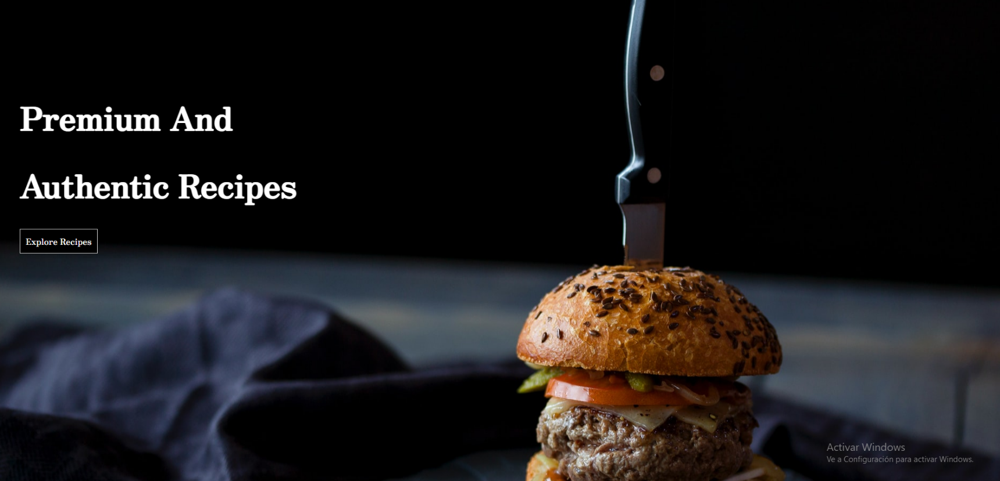
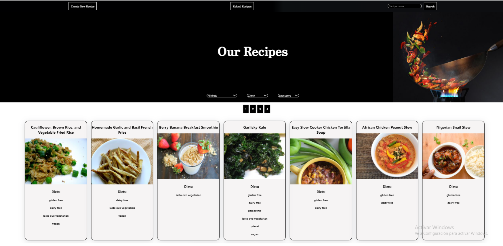
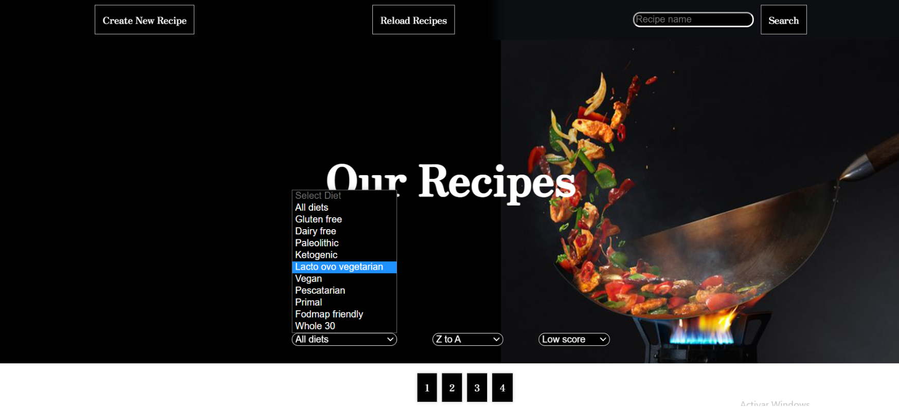
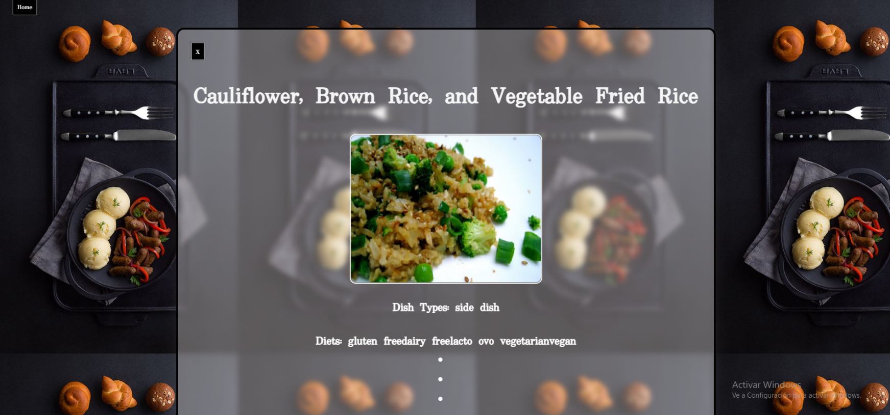
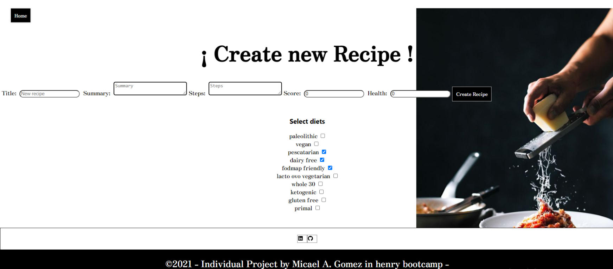

<p align='left'>
    
</p>

# Individual Project - Henry Food

<p align="right">
  
</p>

## Purpose

- Individual proyect for Henry.
- Developed with a time limit of 2 weeks.
- Builded Using React, Redux, Node y Sequelize.
- Crude CSS.
- Laerned better practices.

## Front end

> /Landing



---

> /Home



---



- Create New Recipe.
- SearchBar by name of Recipe.
- Filter By Diets.
- Order alphabetically.
- Order by Score.
- 9 Recipes per page.

---

> /Home/{id}



- On Click --> Recipe Detail

---

> /Recipe



- Create your own recipe !

## INSTRUCTIONS

```bash
  git clone
  npm start on "api" foulder.
  npm start on "client" foulder.

```
